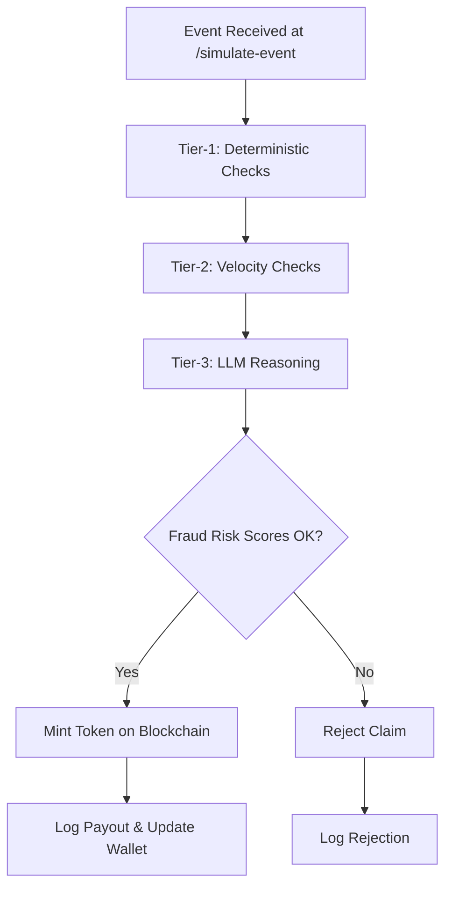
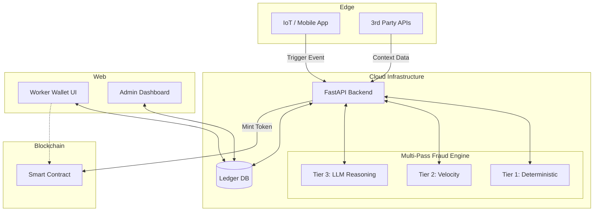
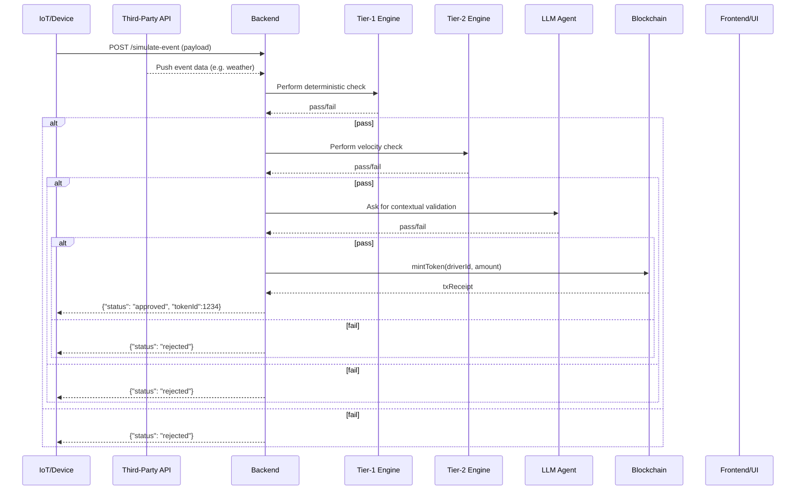

# 🚀 GIG-I: Zero-Touch Parametric Insurance for the Gig Economy
**AI-Powered Income Protection designed for the Gig Workforce.**

---

Gig workers operate on a per-task income model. When heavy rain, flooding, or an unexpected curfew hits, their weekly earnings take an immediate hit. Traditional insurance wasn't built for this—it's too slow, loaded with paperwork, and completely ignores short-term income drops. 

**GIG-I changes the game.** We've built an autonomous, zero-touch insurance platform that constantly monitors real-world disruptions using high-fidelity APIs. When disaster strikes, GIG-I automatically calculates the exact income loss and instant-mints a payout token to the worker's wallet without them ever having to file a claim.

> *"We don't wait for claims. We detect the disruption, calculate the loss, stop the fraud, and pay out instantly."*

## ✨ How It Works
1. **Onboard & Profile:** Workers connect their gig profiles. Our AI generates a **Weekly Risk Score** based on their location, history, and environmental forecasts.
2. **Real-time Monitoring:** We track live meteorological data, traffic APIs, and city-wide alerts.
3. **Trigger & Auto-Pay:** If a trigger condition is met (e.g., >60mm/hour rainfall), the system automatically initiates a payout.

### 🌧️ What Triggers a Payout?
We rely strictly on high-confidence, observable events to avoid basis risk:
*   **Heavy Rain & Flooding:** IMD alerts combined with real-time waterlogging metrics.
*   **Extreme Heat:** >42°C paired with official heatwave advisories. 
*   **Urban Shutdowns:** Curfews or localized commercial zone closures.

*(Note: We use AQI strictly for premium risk-scoring, not as an immediate payout trigger, ensuring the payout pool remains sustainable.)*

## 🛡️ Unbeatable Fraud Defense
How do we stop an attacker from spoofing 500 fake GPS locations during a rainstorm? Simple GPS checks aren't enough. We built a **Multi-Pass Zero-Trust Pipeline**.

**No single signal can reject a claim.** We validate the worker's presence, device integrity (blocking emulators/rooting), historical behavior, and network footprint (stopping Sybil rings). 

*   **Tier 1 (Deterministic):** Fast threshold checks on API rules.
*   **Tier 2 (Velocity):** Historical behavior analysis preventing rapid-fire "ghost" claims.
*   **Tier 3 (LLM Agent):** Our AI reasons through contextual data to catch sophisticated spoofing.

Our defense engine generates a **Fraud Risk Score (FRS)**. Low risk gets auto-approved, while anomalies are delayed for review or structurally isolated. 

### GIG-I's 3-Tier Validation Pipeline


## 🏗️ Architecture Under the Hood
GIG-I is powered by a modern, cloud-agnostic tech stack. We handle massive concurrency seamlessly so we can process thousands of regional triggers in seconds.

*   **Frontend:** React / Vite (Optimized for Mobile-Web)
*   **Backend Engine:** FastAPI (Python async awesomeness)
*   **Machine Learning:** Scikit-learn, XGBoost, Prophet
*   **Database & Ledger:** PostgreSQL (Prisma) + Smart Contracts (ERC-20/721 logic) for immutable payouts.
*   **Security & Encryption:** JWT auth, SHA-256 integrity hashing, AES-256 for PII, and TLS 1.3 for traffic.

### High-Level System Architecture


### End-to-End Execution Sequence
Here's how data flows asynchronously when an event hits our servers:


## 🔌 API & Data Contracts (For Developers)
We've exposed clean RESTful endpoints to hook GIG-I into existing driver applications seamlessly.

**Simulate an Event (`POST /simulate-event`)**
```json
{
  "driverId": 42,
  "eventType": "HeavyRain",
  "timestamp": "2026-04-04T18:30:00Z",
  "location": {"lat": 19.0760, "lon": 72.8777},
  "zone": "A"
}
```
**Successful Payout Response**
```json
{
  "status": "approved",
  "fraudRiskScore": 0.07,
  "tokenId": 1234,
  "message": "Payout minted successfully"
}
```

## 💻 Running GIG-I Locally
Want to spin up the entire GIG-I ecosystem on your machine?

1. Ensure you have **Python 3.x** and **Node.js** installed.
2. Clone the repo and simply double click or run:
   ```bash
   run.bat
   ```
This script will effortlessly install all exact Python requirements, start the FastAPI engine on `localhost:8000`, and boot up the immersive React frontend! 

---
**GIG-I isn't just an insurance policy. It's a completely tamper-proof, AI-driven financial shield built specifically for the invisible engine of the gig economy.**