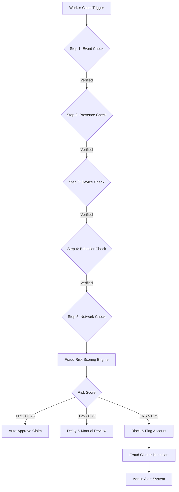

# GiG-I: Parametric Insurance for the Gig Economy
**AI-Powered Income Protection with Adversarial Fraud Defense**

---

## 1. Problem Statement
India’s gig delivery workforce operates on a **per-task income model**, making them highly vulnerable to external disruptions such as heavy rainfall, flooding, extreme heat, and urban shutdowns. 

**The Impact of Disruptions:**
*   **Reduced Hours:** Working hours typically drop by 20–30% during events.
*   **Instant Loss:** Immediate hit to daily and weekly earnings with no safety net.
*   **Systemic Gap:** Traditional insurance is too slow, claim-heavy, and not designed for short-term income protection.

## 2. Solution Overview
GigShield AI is a **Zero-Touch Parametric Insurance Platform** that:
*   **Detects:** Monitors real-world disruptions via high-fidelity APIs.
*   **Predicts:** Uses AI to estimate specific income loss per worker.
*   **Triggers:** Automatically initiates payouts without manual filing.
*   **Defends:** Prevents pool depletion via multi-layer adversarial fraud defense.

## 3. Core Architectural Principles
> *“We minimize **basis risk** by aligning parametric triggers with real, observable income disruption events and minimize **fraud risk** through multi-signal validation instead of single-point verification.”*

## 4. Parametric Triggers: Region-Specific Calibration
We use only high-confidence, income-correlated triggers aligned with **IMD (India Meteorological Department)** standards:

| Disruption Type | Trigger Condition | Justification |
| :--- | :--- | :--- |
| **Heavy Rain** | > 60 mm/hour OR IMD Heavy Rain Alert | Direct drop in delivery volume/safety. |
| **Flooding** | Road closure / Waterlogging signals | Physical blockage of delivery routes. |
| **Extreme Heat** | > 42°C + IMD Heatwave Advisory | Significant drop in worker activity/health risk. |
| **Urban Shutdown** | Curfew / Official Zone Closure | Access to commercial hubs blocked. |

### Environmental Data Scope Management (AQI)
*   **AQI is NOT a payout trigger.** High pollution is persistent and would cause basis risk/pool drain.
*   **Usage:** Only used as a **Risk Scoring feature** and **Premium adjustment signal**. This reduces false payouts and ensures long-term sustainability.

## 5. Weekly Premium Pricing Model
Aligned with the gig worker’s payout cycle:
`Weekly Premium = (Base Rate * Risk Score) + (Coverage Factor * Coverage Amount)`

**AI Adjustments:**
*   **Location Risk:** Historical disruption frequency in specific clusters.
*   **Weather Patterns:** 7-day predictive forecasting.
*   **Worker Activity:** Historical consistency and delivery patterns.

## 6. End-to-End Workflow
1.  **Onboarding** → 2. **AI Risk Profiling** → 3. **Weekly Policy Creation** → 4. **Real-Time Monitoring** → 5. **Parametric Trigger Activation** → 6. **Multi-Layer Fraud Validation** → 7. **Instant Payout**

## 7. AI System Design
### 7.1 Risk Prediction Model
*   **Model:** XGBoost
*   **Output:** Risk Score (0–1) based on location, seasonality, and vehicle type.
### 7.2 Income Loss Estimation
*   **Model:** Gradient Boosting Regression
*   **Output:** Precise ₹ loss estimate during the disruption window.

## 8. Adversarial Defense & Anti-Spoofing Strategy
### The Problem Scenario
*“500 fake GPS claims attempt to drain the payout pool during a legitimate rain event.”* Simple GPS validation is insufficient against sophisticated attackers.

### 9. Multi-Layer Fraud Defense Architecture
| Layer | Signal | What It Detects |
| :--- | :--- | :--- |
| **Event Validation** | Weather/Traffic APIs | Fake/Simulated disruption events. |
| **Location Validation** | GPS Trajectory | "Teleportation" or perfectly linear movement. |
| **Device Integrity** | OS/Root Detection | Use of Magisk, Emulators, or Spoofing tools. |
| **Behavioral Model** | Activity Patterns | "Ghost workers" active only during claims. |
| **Network Analysis** | IP/Device Graph | Coordinated fraud rings and sybil attacks. |

## 10. Signal Redundancy & Validation Logic
**No single signal can reject a claim.** Our system follows **Multi-Signal Independent Validation** to prevent penalizing genuine workers with poor GPS signals.

## 11. Fraud Risk Scoring System (FRS)
We compute a multi-dimensional normalized score (0–1):
`FRS = w1(Event) + w2(Location) + w3(Device) + w4(Behavior) + w5(Network)`

## 12. Decision Policy (Research-Calibrated)
*   **FRS < 0.25:** **Auto-Approve** (Instant Payout).
*   **0.25 ≤ FRS < 0.55:** **Approve** + Silent Monitoring.
*   **0.55 ≤ FRS < 0.75:** **Delayed Payout** + Secondary Validation.
*   **FRS ≥ 0.75:** **HOLD** (Pending manual audit, NOT instant rejection).

## 13. Hard Rejection Rule
A claim is rejected **ONLY IF**:
1.  **FRS > 0.85**
2.  **AND** At least **2 independent signals** are strongly anomalous (e.g., Fake GPS + Rooted Device).

## 14. Coordinated Attack Mitigation (Graph Analytics)
We use **Graph-Based Analysis** to identify coordinated attacks:
*   **Nodes:** Workers, Devices, IP Addresses, UPI Accounts.
*   **Fraud Ring Signal:** Multiple workers + Same IP/Device + Synchronized Claims + Same Zone = **Cluster Flagged**.

## 15. Zero-Trust Validation Pipeline

## 16. False Positive Protection (Fairness First)
*   **GPS Drift Tolerance:** ±100m allowed for urban "canyon" interference.
*   **Review > Reject:** We prioritize investigation over immediate denial.
*   **Transparency:** Workers are notified of delays, not just silent blocks.

## 17. Attack Response Strategy
*   **Zone Payout Cap:** Automated ceiling if claim volume exceeds predicted density by >200%.
*   **Cluster Isolation:** Instantly disconnects all accounts sharing high-risk graph edges.
*   **Manual Override:** Global switch to shift affected zones to manual verification.

## 18. Cybersecurity & Data Integrity Architecture
To ensure the **integrity** and **security** of the platform, GigShield AI implements robust cybersecurity components:
*   **Data Integrity (Hashing):** All sensor data and GPS logs are hashed using **SHA-256** before being stored, preventing any post-event tampering of location history.
*   **Secure Communication (TLS 1.3):** All API interactions between the mobile client and backend services are encrypted via **TLS 1.3**, protecting against Man-in-the-Middle (MITM) attacks.
*   **Identity & Access Management (IAM):** We use **JWT (JSON Web Tokens)** with short-lived access and refresh tokens for worker authentication. Administrative actions require **MFA (Multi-Factor Authentication)**.
*   **Audit Logging:** An immutable audit trail is maintained for every claim trigger, manual review decision, and payout authorization, ensuring full accountability.
*   **End-to-End Encryption (E2EE):** Worker PII (Personally Identifiable Information) and UPI details are encrypted at rest using **AES-256-GCM**.
*   **Rate Limiting & DDoS Protection:** Advanced rate limiting at the API Gateway prevents brute-force attacks on the payout trigger engine.

## 19. Tech Stack
*   **Frontend:** Next.js (Responsive Mobile-Web)
*   **Backend:** Node.js + FastAPI (Python)
*   **ML:** Scikit-learn, XGBoost, Prophet
*   **DB:** PostgreSQL (Prisma ORM)
*   **Security:** JWT, SHA-256, TLS 1.3, AES-256
*   **APIs:** OpenWeatherMap, WAQI, TomTom Traffic
*   **Payments:** Razorpay (Sandbox Simulation)

## 20. System Advantages & Value Proposition
*   **Reduces Basis Risk:** Triggers are strictly correlated to income loss.
*   **India-Optimized:** Uses IMD standards and UPI-first design.
*   **Network-Level Defense:** Detects organized fraud rings, not just individuals.
*   **Robust Integrity:** Cybersecurity components ensure a tamper-proof claim pipeline.
*   **Zero Friction:** Autonomous workflow from trigger to payout.

## 21. Mission Statement
> *“GiG-I transforms insurance from a reactive claims process into a real-time, AI-driven income protection system—secure against coordinated fraud and optimized for India’s gig workforce.”*